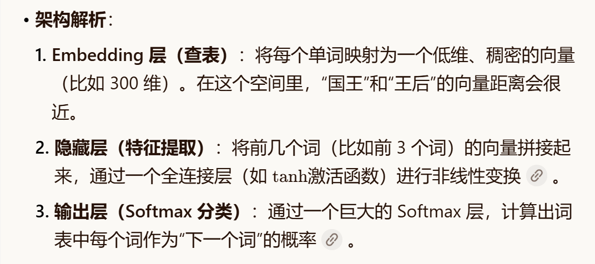
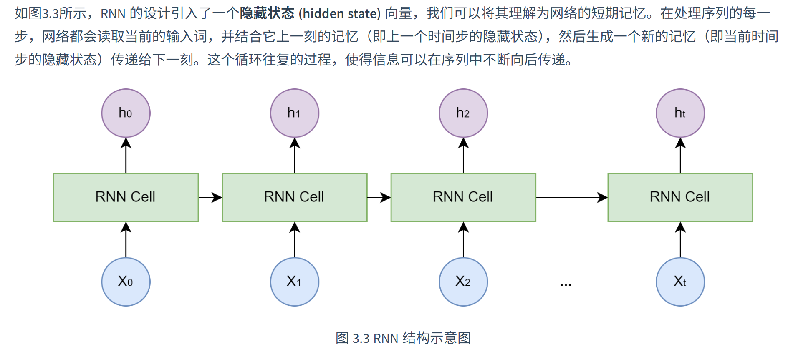
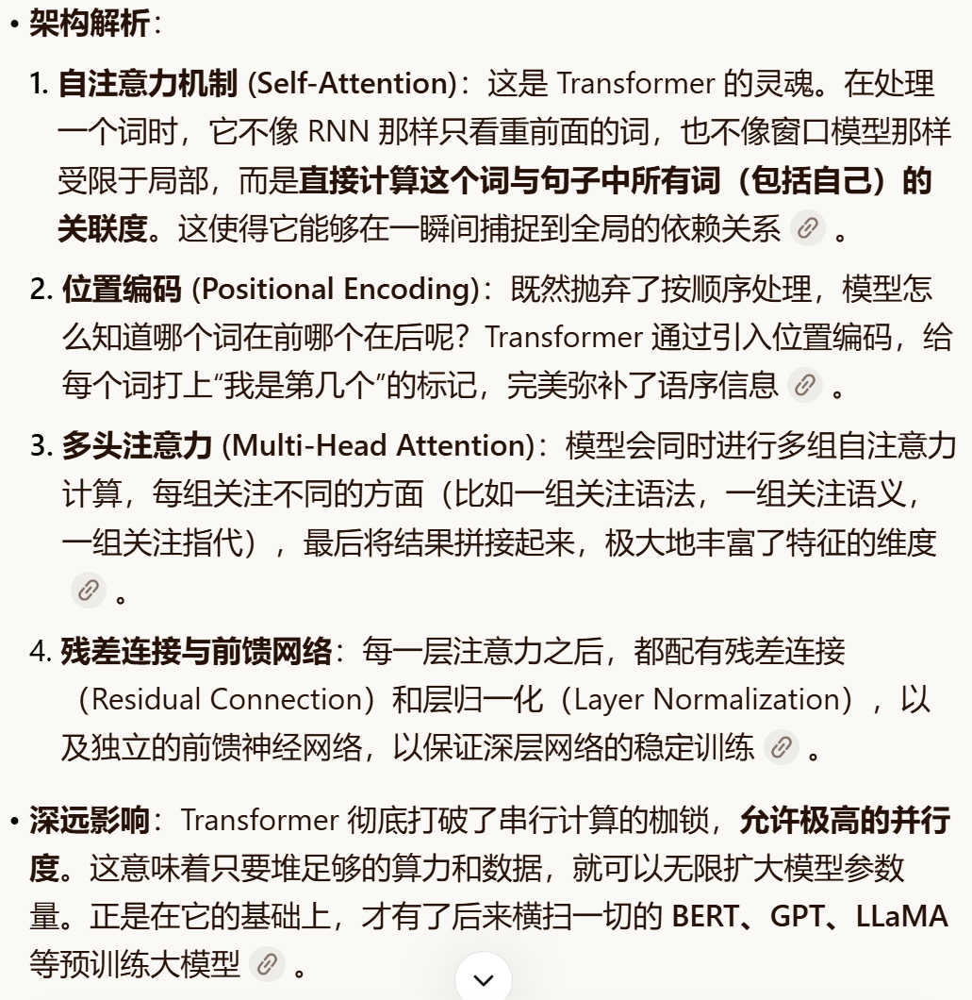
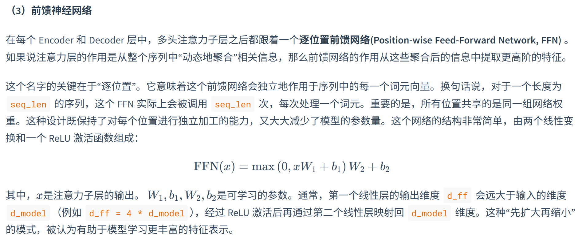
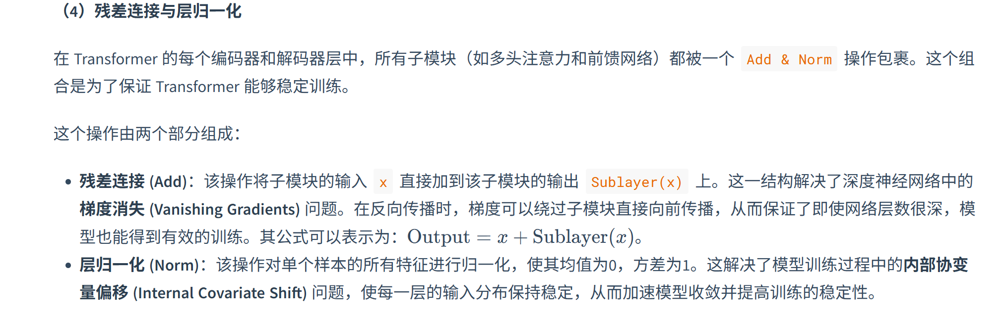

# 大模型语言基础

## N-gram架构

### 基本思想

*P*(*S*)=*P*(*w*1​,*w*2​,…,*wm*​)=*P*(*w*1​)⋅*P*(*w*2​∣*w*1​)⋅*P*(*w*3​∣*w*1​,*w*2​)⋯*P*(*wm*​∣*w*1​,…,*wm*−1​)

引入**马尔可夫假设 (Markov Assumption)** 。其核心思想是：我们不必回溯一个词的全部历史，可以近似地认为，一个词的出现概率只与它前面有限的 n-1 个词有关。

进行最大似然估计后：*P*(*wi*​∣*wi*−1​)=*Count*(*wi*−1​)/*Count*(*wi*−1​,*wi*​)​ 含义就是：我们用“词对 Count(wi-1,wi) 出现的次数”除以“词 Count(wi-1) 出现的总次数”，来作为 P(wi∣wi-1) 的一个近似估计。

### 缺点

参数呈指数级爆炸增长、数据稀疏性（未出现的词序列概率为零，显然不合理）、泛化能力差（无法理解同义词在语义上的相似性）。

## 前馈神经网络语言模型

### 核心思想

1. **构建一个语义空间**：创建一个高维的连续向量空间，然后将词汇表中的每个词都映射为该空间中的一个点。这个点（即向量）就被称为**词嵌入 (Word Embedding)** 或词向量。在这个空间里，语义上相近的词，它们对应的向量在空间中的位置也相近。例如，agent 和 robot 的向量会靠得很近，而 agent 和 apple 的向量会离得很远。

2. **学习从上下文到下一个词的映射**：利用神经网络的强大拟合能力，来学习一个函数。这个函数的输入是前 n-1 个词的词向量，输出是词汇表中每个词在当前上下文后出现的概率分布。

模型为了完成“预测下一个词”这个任务，会不断调整每个词的向量位置，最终使这些向量能够蕴含丰富的语义信息。

**使用余弦相似度 (Cosine Similarity)** ，通过计算两个词向量夹角的余弦值来衡量它们的相似性。（1：完全相关，0：完全无关，-1：完全负相关）。

### 局限

解决了泛化问题，但它和 N-gram 模型一样，上下文窗口是固定大小的。为了预测下一个词，它只能看到前 n−1 个词，再早的历史信息就被丢弃了。

## 循环神经网络 (RNN) 与长短时记忆网络 (LSTM)

### RNN

核心思想：为网络增加记忆能力。

### 缺点：长期依赖问题 (Long-term Dependency Problem)

在训练过程中，模型需要通过反向传播算法根据输出端的误差来调整网络深处的权重。对于 RNN 而言，序列的长度就是网络的深度。当序列很长时，梯度在从后向前传播的过程中会经过多次连乘，这会导致梯度值快速趋向于零（梯度消失）或变得极大（梯度爆炸）。梯度消失使得模型无法有效学习到序列早期信息对后期输出的影响，即难以捕捉长距离的依赖关系。

**长短时记忆网络 (Long Short-Term Memory, LSTM)** ：

解决了长期依赖问题，LSTM 是一种特殊的 RNN，其核心创新在于引入了**细胞状态 (Cell State)** 和一套精密的**门控机制 (Gating Mechanism)** 。细胞状态可以看作是一条独立于隐藏状态的信息通路，允许信息在时间步之间更顺畅地传递。门控机制则是由几个小型神经网络构成，它们可以学习如何有选择地让信息通过，从而控制细胞状态中信息的增加与移除。这些门包括：

- **遗忘门 (Forget Gate)**：决定从上一时刻的细胞状态中丢弃哪些信息。

- **输入门 (Input Gate)**：决定将当前输入中的哪些新信息存入细胞状态。

- **输出门 (Output Gate)**：决定根据当前的细胞状态，输出哪些信息到隐藏状态。

### 局限

只能按顺序处理数据，无法实现大规模并行处理。

## Transformer架构

### 自头注意力和多头注意力机制

自注意力 (Self-Attention) 机制允许模型在处理序列中的每一个词时，都能兼顾句子中的所有其他词，并为这些词分配不同的“注意力权重”。权重越高的词，代表其与当前词的关联性越强，其信息也应该在当前词的表示中占据更大的比重。

为了实现上述过程，自注意力机制为每个输入的词元向量引入了三个可学习的角色：

- **查询 (Query, Q)**：代表当前词元，它正在主动地“查询”其他词元以获取信息。

- **键 (Key, K)**：代表句子中可被查询的词元“标签”或“索引”。

- **值 (Value, V)**：代表词元本身所携带的“内容”或“信息”。

这三个向量都是由原始的词嵌入向量乘以三个不同的、可学习的权重矩阵 (WQ,WK,WV) 得到的

- 准备：对于句子中的每个词，都通过权重矩阵生成其Q,K,V向量。

- 计算相关性得分：要计算词A的新表示，就用词A的Q向量，去和句子中所有词（包括A自己）的K向量进行点积运算。这个得分反映了其他词对于理解词A的重要性。

- 稳定化与归一化：将得到的所有分数除以一个缩放因子dk（dk是K向量的维度），以防止梯度过小，然后用Softmax函数将分数转换成总和为1的权重，也就是归一化的过程。

- 加权求和：将上一步得到的权重分别乘以每个词对应的V向量，然后将所有结果相加。最终得到的向量，就是词A融合了全局上下文信息后的新表示。

### 多头注意力机制

核心思想：把上述过程做完变成分成几组，分开再次进行，再合并。

它将原始的 Q, K, V 向量在维度上切分成 h 份（h 就是“头”数），每一份都独立地进行一次单头注意力的计算。最后，将 h 个输出向量拼接起来，再通过一个线性变换进行整合，就得到了最终的输出。

**缩放法则：**为了达到最优性能，**模型参数量和训练数据量之间存在一个最优配比**。具体来说，最优的模型应该比之前普遍认为的要小，但需要用多得多的数据进行训练。缩放法则最令人惊奇的产物是“能力的涌现”。所谓能力涌现，是指当模型规模达到一定阈值后，会突然展现出在小规模模型中完全不存在或表现不佳的全新能力。例如，**链式思考 (Chain-of-Thought)** 、**指令遵循 (Instruction Following)** 、多步推理、代码生成等能力，都是在模型参数量达到数百亿甚至千亿级别后才显著出现的。

**模型幻觉（Hallucination）**通常指的是大语言模型生成的内容与客观事实、用户输入或上下文信息相矛盾，或者生成了不存在的事实、实体或事件。解决方法：

1. **数据层面**： 通过高质量数据清洗、引入事实性知识以及强化学习与人类反馈 (RLHF) 等方式[13]，从源头减少幻觉。

2. **模型层面**： 探索新的模型架构，或让模型能够表达其对生成内容的不确定性。

3. **推理与生成层面**：

  1. **检索增强生成 (Retrieval-Augmented Generation, RAG)** [14]： 这是目前缓解幻觉的有效方法之一。RAG 系统通过在生成之前从外部知识库（如文档数据库、网页）中检索相关信息，然后将检索到的信息作为上下文，引导模型生成基于事实的回答。

  2. **多步推理与验证**： 引导模型进行多步推理，并在每一步进行自我检查或外部验证。

  3. **引入外部工具**： 允许模型调用外部工具（如搜索引擎、计算器、代码解释器）来获取实时信息或进行精确计算。

智能体经典范式构建和主流框架：

## 经典范式

- **ReAct (Reasoning and Acting)：** 一种将“思考”和“行动”紧密结合的范式，让智能体边想边做，动态调整。智能体不断重复**Thought -> Action -> Observation**的循环，将新的观察结果追加到历史记录中，形成一个不断增长的上下文，直到它在Thought中认为已经找到了最终答案，然后输出结果。

- **Plan-and-Solve：** 一种“三思而后行”的范式，智能体首先生成一个完整的行动计划，然后严格执行。两个核心阶段：

**规划阶段 (Planning Phase)**： 首先，智能体会接收用户的完整问题。它的第一个任务不是直接去解决问题或调用工具，而是**将问题分解，并制定出一个清晰、分步骤的行动计划**。这个计划本身就是一次大语言模型的调用产物。

**执行阶段 (Solving Phase)**： 在获得完整的计划后，智能体进入执行阶段。它会**严格按照计划中的步骤，逐一执行**。每一步的执行都可能是一次独立的 LLM 调用，或者是对上一步结果的加工处理，直到计划中的所有步骤都完成，最终得出答案。

- **Reflection：** 一种赋予智能体“反思”能力的范式，通过自我批判和修正来优化结果。核心工作流程：**执行 -> 反思 -> 优化**：

**执行 (Execution)**：首先，智能体使用我们熟悉的方法（如 ReAct 或 Plan-and-Solve）尝试完成任务，生成一个初步的解决方案或行动轨迹。这可以看作是“初稿”。

**反思 (Reflection)**：接着，智能体进入反思阶段。它会调用一个独立的、或者带有特殊提示词的大语言模型实例，来扮演一个“评审员”的角色。这个“评审员”会审视第一步生成的“初稿”，并从多个维度进行评估，例如：

**优化 (Refinement)**：最后，智能体将“初稿”和“反馈”作为新的上下文，再次调用大语言模型，要求它根据反馈内容对初稿进行修正，生成一个更完善的“修订稿”。

## 主流框架

- **AutoGen**：AutoGen 的核心思想是通过对话实现协作[1]。它将多智能体系统抽象为一个由多个“可对话”智能体组成的群聊。开发者可以定义不同角色（如 Coder, ProductManager, Tester），并设定它们之间的交互规则（例如，Coder 写完代码后由 Tester 自动接管）。任务的解决过程，就是这些智能体在群聊中通过自动化消息传递，不断对话、协作、迭代直至最终目标达成的过程。**（分层设计，异步优先）**

- **AgentScope**：AgentScope 是一个专为多智能体应用设计的、功能全面的开发平台[2]。它的核心特点是**易用性**和**工程化**。它提供了一套非常友好的编程接口，让开发者可以轻松定义智能体、构建通信网络，并管理整个应用的生命周期。其内置的**消息传递机制**和对分布式部署的支持，使其非常适合构建和运维复杂、大规模的多智能体系统。**（消息驱动的架构设计）**

- **CAMEL**：CAMEL 提供了一种新颖的、名为**角色扮演 (Role-Playing)** 的协作方法[3]。其核心理念是，我们只需要为两个智能体（例如，AI研究员 和 Python程序员）设定好各自的角色和共同的任务目标，它们就能在“**初始提示 (Inception Prompting)**”的引导下，自主地进行多轮对话，相互启发、相互配合，共同完成任务。它极大地降低了设计多智能体对话流程的复杂度。**（角色扮演 (Role-Playing) 和 引导性提示 (Inception Prompting)。）**

- **LangGraph**：作为 LangChain 生态的扩展，LangGraph 另辟蹊径，将智能体的执行流程建模为**图 (Graph)**[4]。在传统的链式结构中，信息只能单向流动。而 LangGraph 将每一步操作（如调用LLM、执行工具）定义为图中的一个**节点 (Node)**，并用**边 (Edge)** 来定义节点之间的跳转逻辑。这种设计天然支持**循环 (Cycles)**，使得实现如 Reflection 这样的迭代、修正、自我反思的复杂工作流变得异常简单和直观。

高级知识拓展：

## 记忆模块

### 一、核心架构（四层四类型）

四层架构：工具层 → 记忆核心层 → 记忆类型层 → 存储层。

### 四种记忆类型

1. 工作记忆：纯内存，TTL自动清理，存储当前会话上下文（默认10条/2000 tokens）。

2. 情景记忆：SQLite（权威存储）+ Qdrant（向量索引），记录具体事件与学习经历。

3. 语义记忆：Qdrant（向量）+ Neo4j（知识图谱），存储抽象知识、用户偏好与规则。

4. 感知记忆：SQLite（元数据）+ Qdrant（多模态向量），处理图像、音频等跨模态信息。

### 二、存储与检索方案

### 混合存储

* SQLite：存储结构化元数据，进行时间/会话/重要性过滤。

* Qdrant：向量存储，支持多语言（默认

"paraphrase-multilingual-MiniLM-L12-v2"）与多模态检索。

* Neo4j：图存储，用于实体识别与关系推理。

**智能检索：**采用向量检索 + 图检索 + 融合排序的多路召回策略。Embedding服务支持云端（DashScope）、本地Transformer及TF-IDF降级。

### 三、记忆生命周期管理

遵循认知科学流程：编码 → 存储 → 检索 → 整合 → 遗忘。

* 整合：将短期记忆（工作记忆）转化为长期记忆（情景/语义记忆）。

* 遗忘：基于重要性评分、时间衰减与存储配额动态清理。

* 评分公式示例：

"(相似度 × 时间衰减) × (0.8 + 重要性 × 0.4)"。

## RAG模块

### 一、核心架构

构建一个RAG（检索增强生成）系统主要包括两个阶段：**数据索引和查询处理。**

### 1. 数据索引阶段（离线）

- 文档加载：从多种来源（如PDF、Word、网页、数据库）提取文本。

- 文本分割：将长文档切成小块，以便后续检索。常用的方法有固定长度分割、按段落分割或按语义分割。

- 向量化：使用嵌入模型（如BERT、OpenAI的嵌入模型）将文本块转换为向量。

- 存储：将向量和对应的文本块存入向量数据库（如Pinecone、Chroma、Qdrant），并建立索引以便快速检索。

### 2. 查询处理阶段（在线）

- 查询向量化：将用户查询转换为向量。

- 检索：从向量数据库中找出与查询向量最相似的文本块（通常使用近似最近邻搜索，如HNSW）。

- 重排序（可选）：对检索结果进行重新排序，以提升Top结果的准确性。

- 提示构建：将检索到的文本块和用户查询组合成一个提示（Prompt）。

- 生成：将提示发送给大语言模型（如GPT-4），生成最终答案。

### 3. 优化与进阶

- 检索优化：可以采用混合检索（结合向量检索和关键词检索）、查询扩展、多向量表示等。

- 生成优化：设计好的提示模板，让模型基于检索内容生成，并注明引用来源。

- 评估与迭代：通过人工评估或自动指标（如检索召回率、生成答案的准确性）持续优化系统。

### 4. 工程考虑

- 可扩展性：支持增量索引，处理大量文档。

- 实时性：保证检索和生成的低延迟。

- 可观测性：记录检索和生成的关键指标，便于调试。

### 二、高级检索策略

### 2.1 查询优化技术

- **多查询扩展（MQE）：**用LLM生成语义等价的多样化查询，提高召回率

- **假设文档嵌入（HyDE）：**让LLM生成假设答案，用假设答案检索真实文档

- **扩展检索框架：**整合MQE和HyDE。让用户可以根据具体场景选择启用哪些策略。对扩展查询并行执行向量检索，获取候选文档池；通过去重和分数排序合并所有结果，返回最相关的**top-k**文档。

- **查询重写：**将模糊查询重写为更具体的检索友好查询

- **分步查询：**复杂问题分解为多个子查询

### 2.2 检索增强技术

- 混合检索：向量检索 + 关键词检索（BM25/TF-IDF）

- 多向量检索：为同一文档存储不同粒度的向量（摘要、细节）

- 多模态检索：文本、图像、表格的统一检索

- 图检索：利用知识图谱的关系推理能力

## 上下文工程模块

### 一、核心概念

上下文工程：在有限的LLM上下文窗口中，系统化地选择、组织和优化输入信息，以提升模型推理的稳定性和准确性。区别于提示词工程（优化单次指令），上下文工程关注多轮对话中的信息管理。

核心问题：解决“上下文腐蚀”——随着上下文长度增加，模型准确回忆信息的能力下降。

### 二、GSSC四阶段流水线（ContextBuilder实现）

1. Gather（收集）

从多源汇集候选信息：

- 系统指令（必选，最高优先级）

- 记忆检索结果（从长期记忆库）

- RAG检索结果（从知识库）

- 对话历史（最近N轮）

- 自定义信息包

2. Select（选择）

基于评分算法筛选最有价值信息：

- 评分公式：score = relevance_weight × relevance_score + recency_weight × recency_score

- 贪心选择：按分数从高到低填充，直到达到token预算

- 阈值过滤：低于min_relevance的信息被丢弃

3. Structure（结构化）

按固定模板组织选中信息：

[Role & Policies] # 系统指令

[Task] # 当前任务描述

[Evidence] # RAG检索的证据

[Context] # 对话历史与记忆

[Output] # 输出格式要求

4. Compress（压缩）

当超出token预算时的兜底策略：

- 分区压缩：对每个模板分区单独压缩

- 智能摘要：用LLM生成高保真摘要（需额外调用）

- 简单截断：按配置截断方向（head/tail）截断

### 三、长时程任务策略

### 1. 压缩整合（Compaction）

- 场景：长对话连续性任务

- 方法：对话接近上限时，对历史进行高保真总结，用摘要重启新窗口

- 效果：节省79% token成本（50轮→10轮+摘要）

### 2. 结构化笔记（Structured Note-taking）

- 场景：迭代式开发与研究

- 方法：智能体定期将关键信息写入持久化存储（如Markdown/YAML），需要时按精确检索拉回

- 工具：NoteTool(保存为可精确检索的格式Markdown + YAML)实现（Memory是向量存储+相关性检索，NoteTool是结构化存储+精确检索）

### 3. 子代理架构（Sub-agent architectures）

- 场景：复杂研究与分析

- 方法：主代理负责高层规划，专长子代理在干净上下文中深挖，仅回传凝练摘要

- 优势：主代理上下文保持简洁，支持并行探索

### 四、配置与优化

关键配置参数

python

python

config = Config(

context_window=128000, # 上下文窗口大小

compression_threshold=0.8, # 压缩阈值（80%）

min_retain_rounds=10, # 保留最近轮次数

enable_smart_compression=False, # 智能摘要开关

tool_output_max_lines=2000, # 工具输出最大行数

tool_output_truncate_direction="head" # 截断方向

)

性能优化

- 缓存友好设计：只追加不编辑，避免破坏KV Cache

- 工具输出截断：防止大文件输出塞满上下文

- 会话序列化：支持保存/恢复对话状态

### 五、面试要点

核心问题

1. 上下文工程与提示词工程的区别？

  - 提示词工程：优化单次指令表达

  - 上下文工程：管理多轮对话中的信息选择与组织

2. GSSC流水线各阶段的作用？

  - Gather：多源信息汇集

  - Select：基于相关性+新近性智能筛选

  - Structure：按模板结构化组织

  - Compress：超限时的兜底压缩

3. 三种长时程策略的应用场景？

  - 压缩整合：长对话连续性任务

  - 结构化笔记：迭代式开发

  - 子代理架构：复杂并行研究

4. NoteTool与Memory的区别？

  - Memory：向量存储，相关性检索，自动清理

  - NoteTool：结构化存储，精确检索，永久保存，可手动管理

设计思考

- 为什么需要上下文工程：解决上下文腐蚀和注意力预算有限问题

- 如何平衡相关性与新近性：通过权重配置（默认0.7:0.3）

- 如何处理工具大输出：统一截断机制，完整输出保存到文件

- 如何保证压缩质量：分区压缩保持结构，智能摘要保留关键信息

